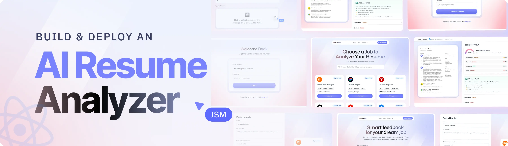

# SkillScanX 🎯

**Smart feedback for your dream job!**

SkillScanX is an AI-powered resume analyzer that provides comprehensive feedback on your resume's ATS (Applicant Tracking System) compatibility. Get instant insights, detailed scoring, and actionable suggestions to optimize your resume for better job application success.



## ✨ Features

- **🤖 AI-Powered Analysis**: Advanced algorithms analyze your resume content and structure
- **📊 ATS Compatibility Scoring**: Get detailed scores on how well your resume works with ATS systems
- **📈 Multi-Category Evaluation**: Comprehensive scoring across different resume aspects
- **💡 Smart Suggestions**: Actionable recommendations to improve your resume
- **📱 Responsive Design**: Beautiful, modern UI that works on all devices
- **🔒 Secure Storage**: Your resumes are safely stored with authentication
- **📄 PDF Support**: Upload and analyze PDF resumes seamlessly
- **📋 Application Tracking**: Keep track of your job applications and resume versions

## 🚀 Demo

Experience SkillScanX in action with our intuitive interface:


## 🛠️ Tech Stack

- **Frontend**: React 19, TypeScript, Tailwind CSS
- **Routing**: React Router v7
- **State Management**: Zustand
- **PDF Processing**: PDF.js
- **Authentication**: Puter Auth
- **Storage**: Puter KV Store
- **Build Tool**: Vite
- **Deployment**: Docker Ready

## 📦 Installation

### Prerequisites

- Node.js (v18 or higher)
- npm or yarn

### Local Development

1. **Clone the repository**
   ```bash
   git clone https://github.com/kartigopal01/SkillScanX.git
   cd SkillScanX
   ```

2. **Install dependencies**
   ```bash
   npm install
   ```

3. **Start the development server**
   ```bash
   npm run dev
   ```

4. **Open your browser**
   Navigate to `http://localhost:5173`

### Production Build

```bash
npm run build
npm start
```

## 🐳 Docker Deployment

SkillScanX comes with Docker support for easy deployment:

```bash
# Build the Docker image
docker build -t skillscanx .

# Run the container
docker run -p 3000:3000 skillscanx
```

## 🎯 Usage

1. **Sign Up/Login**: Create an account or sign in to access the platform
2. **Upload Resume**: Drag and drop your PDF resume or click to browse
3. **Get Analysis**: Wait for the AI to analyze your resume (usually takes a few seconds)
4. **Review Results**: 
   - Overall ATS compatibility score
   - Category-wise breakdown
   - Detailed suggestions for improvement
5. **Track Applications**: Manage multiple resume versions and applications
6. **Implement Changes**: Use the suggestions to optimize your resume

## 📊 Scoring System

SkillScanX uses a comprehensive scoring system:

- **🟢 70-100**: Excellent ATS compatibility
- **🟡 50-69**: Good with room for improvement  
- **🔴 0-49**: Needs significant optimization

### Evaluation Categories

- **Content Quality**: Relevance and clarity of information
- **Format Compatibility**: ATS-friendly formatting
- **Keyword Optimization**: Industry-relevant keywords
- **Structure**: Organization and readability
- **Contact Information**: Completeness and format

## 📁 Project Structure

```
SkillScanX/
├── app/
│   ├── components/          # React components
│   │   ├── ATS.tsx         # ATS analysis display
│   │   ├── FileUploader.tsx # Resume upload component
│   │   ├── ScoreGauge.tsx  # Score visualization
│   │   └── ...
│   ├── routes/             # Application routes
│   ├── lib/                # Utility functions
│   └── root.tsx            # Root component
├── public/                 # Static assets
├── types/                  # TypeScript definitions
├── constants/              # Application constants
└── package.json
```

## 🔧 Configuration

The application uses environment variables for configuration. Create a `.env` file in the root directory:

```env
# Add your environment variables here
# (Update based on your specific needs)
```

## 🤝 Contributing

Contributions are welcome! Please feel free to submit a Pull Request. For major changes, please open an issue first to discuss what you would like to change.

### Development Guidelines

1. Fork the repository
2. Create your feature branch (`git checkout -b feature/AmazingFeature`)
3. Commit your changes (`git commit -m 'Add some AmazingFeature'`)
4. Push to the branch (`git push origin feature/AmazingFeature`)
5. Open a Pull Request

### Code Style

- Use TypeScript for all new files
- Follow the existing code style and conventions
- Add proper types and interfaces
- Write meaningful commit messages

## 🐛 Bug Reports

If you find a bug, please open an issue with:
- Clear description of the problem
- Steps to reproduce
- Expected vs actual behavior
- Screenshots if applicable

## 📄 License

This project is licensed under the MIT License - see the [LICENSE](LICENSE) file for details.

## 👨‍💻 Author

**Karti Gopal**
- GitHub: [@kartigopal01](https://github.com/kartigopal01)
- Repository: [SkillScanX](https://github.com/kartigopal01/SkillScanX)

## 🙏 Acknowledgments

- Thanks to all contributors and users
- Built with ❤️ using modern web technologies
- Inspired by the need for better resume optimization tools

## 📞 Support

If you like this project, please give it a ⭐ on GitHub!

For support, please open an issue on GitHub or reach out through the repository.

---

**Made with ❤️ for job seekers everywhere**
